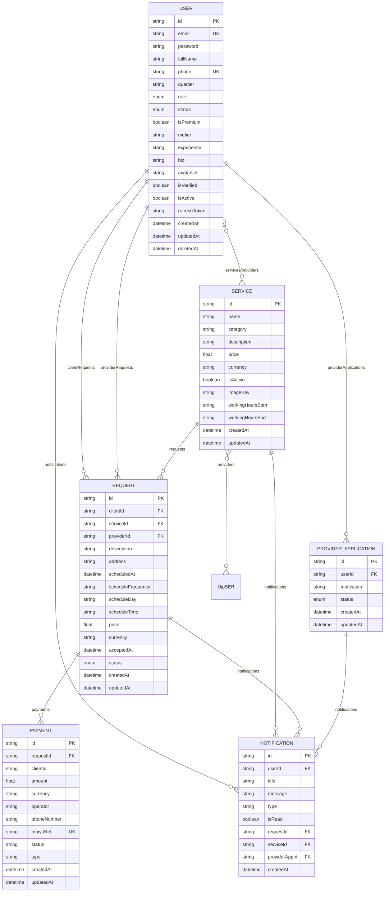

# Diagramme de la base de données backend

```mermaid
erDiagram
    USER ||--o{ REQUEST : "clientRequests"
    USER ||--o{ REQUEST : "providerRequests"
    USER ||--o{ PROVIDER_APPLICATION : "providerApplications"
    USER ||--o{ NOTIFICATION : "notifications"
    USER }o--o{ SERVICE : "services/providers"

    SERVICE ||--o{ REQUEST : "requests"
    SERVICE ||--o{ NOTIFICATION : "notifications"
    SERVICE }o--o{ UipSER : "providers"

    REQUEST ||--o{ PAYMENT : "payments"
    REQUEST ||--o{ NOTIFICATION : "notifications"

    PROVIDER_APPLICATION ||--o{ NOTIFICATION : "notifications"

    USER {
        string id PK
        string email UK
        string password
        string fullName
        string phone UK
        string quartier
        enum role
        enum status
        boolean isPremium
        string metier
        string experience
        string bio
        string avatarUrl
        boolean isVerified
        boolean isActive
        string refreshToken
        datetime createdAt
        datetime updatedAt
        datetime deletedAt
    }

    SERVICE {
        string id PK
        string name
        string category
        string description
        float price
        string currency
        boolean isActive
        string imageKey
        string workingHoursStart
        string workingHoursEnd
        datetime createdAt
        datetime updatedAt
    }

    REQUEST {
        string id PK
        string clientId FK
        string serviceId FK
        string providerId FK
        string description
        string address
        datetime scheduledAt
        string scheduleFrequency
        string scheduleDay
        string scheduleTime
        float price
        string currency
        datetime acceptedAt
        enum status
        datetime createdAt
        datetime updatedAt
    }

    PAYMENT {
        string id PK
        string requestId FK
        string clientId
        float amount
        string currency
        string operator
        string phoneNumber
        string mbiyoRef UK
        string status
        string type
        datetime createdAt
        datetime updatedAt
    }

    PROVIDER_APPLICATION {
        string id PK
        string userId FK
        string motivation
        enum status
        datetime createdAt
        datetime updatedAt
    }

    NOTIFICATION {
        string id PK
        string userId FK
        string title
        string message
        string type
        boolean isRead
        string requestId FK
        string serviceId FK
        string providerAppId FK
        datetime createdAt
    }
```

Vous pouvez ouvrir ce fichier avec l’aperçu Mermaid de VS Code pour obtenir le rendu visuel.
