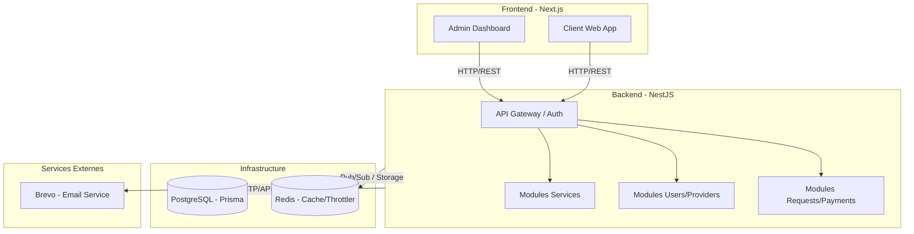
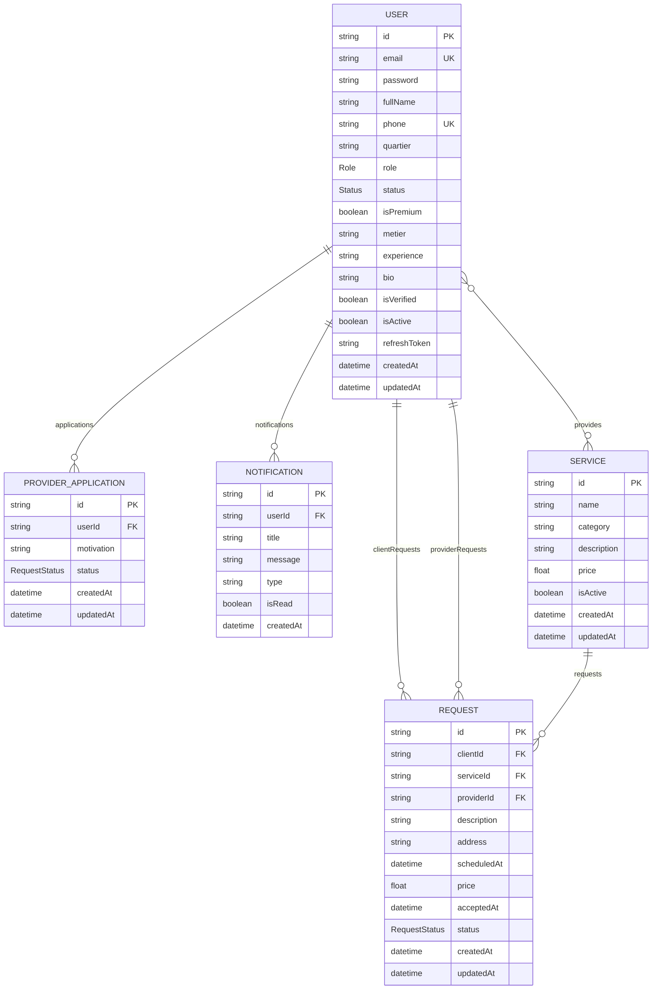
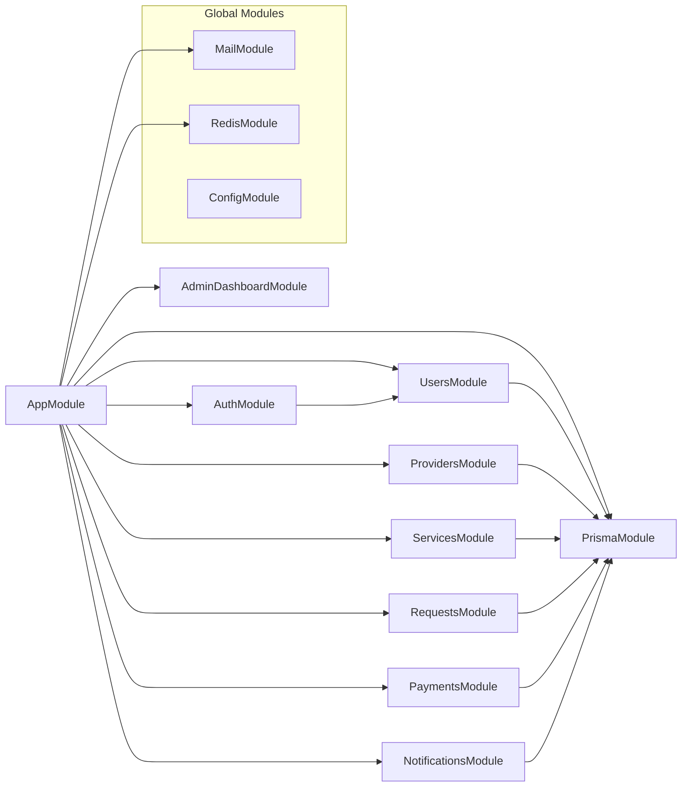

# Architecture du Projet Kaskade

## Graphe d'Architecture Globale




## Schéma de Base de Données (ERD)



## Graphe de Dépendance des Modules Backend (NestJS)



## Plan des Routes Frontend (Next.js App Router)

```mermaid
graph TD
    Home[/] --> Login[/(auth)/login]
    Home --> Register[/(auth)/register]

    subgraph Auth_Group [Authentification]
        Login
        Register
        Forgot[/(auth)/forgot-password]
        Reset[/(auth)/reset-password]
        Verify[/(auth)/verify-otp]
    end

    subgraph User_Space [Espace Utilisateur]
        Dashboard[/dashboard]
        Demandes[/mes-demandes]
        Services[/services]
        Notifs[/notifications]
    end

    subgraph Admin_Space [Espace Administration]
        AdminDash[/admin/dashboard]
        AdminUsers[/admin/users]
        AdminRequests[/admin/requests]
        AdminFinancials[/admin/financials]
        AdminAnalytics[/admin/analytics]
        AdminSettings[/admin/settings]
        AdminNotifs[/admin/notifications]
    end

    Dashboard --> Demandes
    Dashboard --> Services
    Dashboard --> Notifs
```
